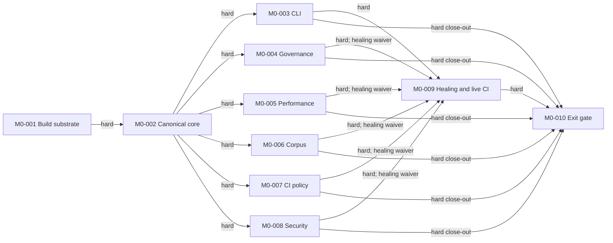

# M0 Implementation Plan

**Scope:** M0 only  
**Planning basis:** verifier-approved `specs/10` through `specs/16` and the
foundation documents, with no remaining pre-planning phase  
**Plan state:** ready for bundle authoring; every task begins `PENDING`

This plan uses a contract-first DAG. M0-001 and M0-002 establish the only
build and evidence foundations; six delivery lanes then proceed concurrently;
M0-009 heals fixture-isolated integrations and realizes GitHub Actions; and
M0-010 performs the clean release-candidate gate. Only relationships recorded
as `Depends On` in the generated ledger are scheduling prerequisites. Soft
couplings below are interface-coordination obligations, not readiness edges.

## Accepted Planning Decisions

- M0-001 must pin Glaze v7.5.0 behind an Orus-owned canonicalization boundary,
  utf8proc for NFC, the compatible pinned OpenSSL 3 EVP interface for SHA-256,
  GoogleTest, and Google Benchmark. It must select and record the remaining
  exact mutually compatible versions and immutable digests under q-0003; this
  plan invents no missing coordinates. Glaze is exposed only through
  Bazel/Bzlmod and Nix, never its optional CMake workflow.
- M0-004 implements the deterministic SPDX 2.3 JSON emitter in Orus. It reads
  only the admitted resolved Nix/Bazel graph, validates against a pinned SPDX
  schema/profile, and identifies the emitter by exact source and artifact
  digests.
- Native and untrusted parsing plus canonical core data logic stay in C++23.
  Hermetically pinned Python implements cold governance, CI, security, and
  release orchestration; it does not become the untrusted-parser authority.
  Any Python canonical emission from already validated typed data remains
  non-authoritative until its cross-language goldens are byte-identical to the
  C++23 core.
- Local GitHub workflow simulation is preliminary evidence. M0-009 must obtain
  a live GitHub Actions run for the exact revision. Any push or branch-
  protection change requires a separate explicit authorization at execution
  time, and the run, artifacts, permissions, triggers, cancellation behavior,
  and required-check state must be retained.

## Context Map

Every task reads `SPECS.md`, `specs/00-CHARTER.md` Sections 1, 3, 7-11,
`specs/01-GLOSSARY.md`, the applicable accepted decisions in
`specs/02-DECISIONS.md`, `specs/03-RISKS.md`, and
`specs/_reviews/2026-07-21_phaseM0_review.md`. The following is the additional
minimum required reading before `PLANNED`.

| Task | Required reading |
|---|---|
| M0-001 | `specs/10-build-environment.md` Sections 4, 6.1, 6.3, 6.4, and 11; D-003, D-004, D-011; q-0003 and q-0012. |
| M0-002 | Spec `10` Sections 6.2-6.4; spec `11` Sections 6.1.2-6.1.3; spec `14` Sections 6.2-6.4; spec `15` Sections 6.2 and 6.4; spec `16` Sections 6.3-6.4; q-0012 and q-0014. |
| M0-003 | `specs/12-cli-diagnostics.md` in full and spec `10` Sections 6.2-6.3. |
| M0-004 | `specs/11-governance-release.md` in full; spec `16` Section 6.5 final-scan ordering; D-002, D-009; q-0013 and q-0014. |
| M0-005 | `specs/14-performance-foundation.md` in full; spec `13` CI-FR-006/CI-FR-011; spec `16` parser/resource rows; D-006 and D-010. |
| M0-006 | `specs/15-concurrent-corpus.md` in full; spec `14` workload registration; spec `16` native-parser requirements; D-005. |
| M0-007 | `specs/13-ci-quality.md` in full; spec `10` acquisition contract; spec `16` capability and evidence-limit rows; D-010; q-0014 and q-0015. |
| M0-008 | `specs/16-security-foundations.md` in full; spec `11` release-gate DAG; owner resource contracts in specs `10`-`15`; D-007, D-008, D-013, D-015; q-0014. |
| M0-009 | All seven domain Test & Verification Plan sections; the final M0 review; q-0015; every producer interface frozen by M0-002 through M0-008. |
| M0-010 | Charter Sections 6-11; every domain NFR and Test & Verification Plan; spec `11` release state machine; spec `16` release secret-scan profiles. |

## PDCA Unit A3 Summaries

### M0-001 — Hermetic Build, Toolchain, and Test Skeleton

- **Functional goal:** establish the single Nix-to-Bazel source path, exact
  reference pinset and dependency ADR, C++23 toolchains/configurations,
  acquisition boundary, and test/benchmark infrastructure.
- **Root cause / primary risk:** Nix and Bazel can become competing owners, an
  apparently pinned toolchain can fall back to host tools, and independently
  chosen library pins can be ABI- or closure-incompatible. Glaze's optional
  CMake workflow is an additional alternate-path hazard.
- **Countermeasure / Check:** treat the complete source-to-action ownership
  chain as one unit; admit every dependency with an immutable digest; expose
  Glaze only through Bzlmod/Nix; prove lock stability, tool selection, aquery
  ownership, offline actions, broken-fallback detection, and prohibited-path
  fixtures through the ledger command. Bootstrap admission records are written
  directly against the verified spec and reviewed before lock entry; M0-004
  later supplies their automated linter/reconciler without creating a reverse
  dependency.
- **Dependency classification:** no predecessor. Its root files are a hard
  prerequisite for M0-002; later domains only propose changes to these files
  through M0-001 ownership review.

### M0-002 — Canonical Evidence, Identity, and Reference-Environment Core

- **Functional goal:** provide the shared bounded canonical-JSON/NFC/SHA-256
  boundary, build/reference facts, subject identities, package identity, typed
  limits, and C++/Python goldens consumed by every evidence producer.
- **Root cause / primary risk:** seven domains can emit individually plausible
  but byte-incompatible documents, especially for duplicate names, Unicode,
  integer bounds, digests, and exact-bound/first-over resource behavior.
- **Countermeasure / Check:** hide Glaze, utf8proc, and OpenSSL behind one
  versioned Orus API; use canonical-byte and statistic goldens, cross-language
  differential tests, native fuzzing, ASan/UBSan, and a package-scoped 70%
  coverage floor before consumers branch.
- **Dependency classification:** M0-001 is hard. Once M0-002 is `DONE`, its
  public contracts are frozen; consumer implementation details are soft
  couplings unless a ledger dependency states otherwise.

### M0-003 — CLI Diagnostics and Environment Truthfulness

- **Functional goal:** deliver the real `orus --version` and `orus doctor`,
  including seven-row inventory reconciliation, host observation, typed exits
  and streams, atomic rendering, and truthful support language.
- **Root cause / primary risk:** aggregate/component error precedence can turn
  unknown or malformed facts into a false pass, skip independent checks, or
  commit partial output before a renderer/resource failure.
- **Countermeasure / Check:** consume immutable M0-002 contracts; use
  subprocess and syscall-access tests, one negative per row, multi-failure and
  renderer-fault fixtures, exact bounds, claim scanning, and 100 byte-identical
  fresh invocations.
- **Dependency classification:** M0-002 is hard. Governance claim scanning and
  security/release consumption are soft downstream couplings; this unit is not
  isolated because it tests the real CLI locally.

### M0-004 — Governance, Dependency Admission, SBOM, and Release-Contract Tooling

- **Functional goal:** deliver license/contribution/ADR policy, dependency and
  notice admission, the Orus SPDX emitter, evidence/claim validators, agent
  guidance, and the fail-closed release state machine.
- **Root cause / primary risk:** lock, admission, SBOM, notice, evidence,
  secret-scan, and approval identities can drift or form a self-referential
  cycle while still looking complete; cold Python and native canonical bytes
  can also diverge.
- **Countermeasure / Check:** reconcile the admitted resolved graph one-to-one;
  validate a pinned SPDX profile independently; bind emitter source/artifact
  identities; enforce canonical cross-language goldens; exercise malformed,
  mutation, concurrency, cancellation, and DAG fixtures with no marker on any
  failure.
- **Dependency classification:** M0-002 is hard. Real producer reports are a
  soft dependency isolated behind canonical synthetic bundles; M0-009 is the
  mandatory healing task, so M0-004 parks `BLOCKED (Awaiting Healing)` instead
  of reaching `DONE` after fixture verification.

### M0-005 — Performance Harness, Comparator, and Allocation Accounting

- **Functional goal:** implement the five workload records, paired harness,
  complete schemas, controlled-runner/authority model, exact comparator,
  allocation instrumentation, noise policy, and escalation evidence.
- **Root cause / primary risk:** floating arithmetic, library RNG/statistics,
  sample trimming, or authority leakage can make the strict 3% policy
  non-repeatable or let shared-runner data become blocking.
- **Countermeasure / Check:** use checked integer arithmetic, the specified
  SHA-256 counter sampler and fixed schedule, retained raw samples, independent
  intermediate goldens, authority cross-products, positive/zero allocation
  controls, parser fuzzing, and exact resource boundaries.
- **Dependency classification:** M0-002 is hard. Corpus registration and CI
  advisory transport are soft contract couplings isolated with fixtures and
  healed by M0-009. Controlled-runner simulations verify contract logic only;
  they do not claim a real M0 controlled-runner substrate, whose provisioning
  is explicitly out of scope.

### M0-006 — Native Concurrent Corpus and Reliability Harness

- **Functional goal:** implement the parent/exec-child topology, five workers,
  exact `SOCK_SEQPACKET` protocol, fixed observations/result, fault matrix,
  bounded cleanup, canonical reports, and 100-run gate.
- **Root cause / primary risk:** sleep-based ordering, relative timeouts, PID
  assumptions, or incomplete escalation can make lifecycle tests intermittent
  and leave descendants/resources after nominal success.
- **Countermeasure / Check:** predicate-based synchronization, one propagated
  absolute deadline, byte-level frame goldens, syscall/fault injection,
  process-group absence proofs, sanitizer/TSan configurations, and 100 fresh
  sequential real subprocess runs.
- **Dependency classification:** M0-002 is hard. The corpus itself exercises
  the real local kernel/process boundary; only performance-registry and CI
  consumer adapters are isolated, with M0-009 as their healing task.

### M0-007 — CI Policy, Applicability, and Evidence Aggregator

- **Functional goal:** implement finite target applicability, warning policy,
  workflow security/topology, bounded evidence, advisory separation, timeout
  semantics, and the fail-closed gate aggregator.
- **Root cause / primary risk:** a green local workflow can conceal an empty
  target group, host fallback, stale evidence, extra permission, incorrect
  cancellation semantics, or behavior that differs at the GitHub provider.
- **Countermeasure / Check:** generate jobs from a finite committed contract;
  reconcile queried labels; mutate every permission/capability/evidence state;
  distinguish report/log/bundle limits exactly; then require M0-009 to repeat
  the proof against a live exact-revision provider run.
- **Dependency classification:** M0-002 is hard. Domain report producers are
  soft couplings. Local workflow/provider simulation is the registered
  `github-actions` substitute; M0-009 is both the healing and realization task.

### M0-008 — Security Controls, Secret Scanning, and Parser Assurance

- **Functional goal:** implement security/capability/resource/parser
  inventories, exact offline Gitleaks orchestration, byte-preserving metadata
  scans, subject integrity, exception/claim controls, and fuzz assurance.
- **Root cause / primary risk:** generated names or source identities can evade
  content-only scans, while including the current scan pair or approval marker
  can create a release cycle; redacted evidence can accidentally retain raw
  secret-bearing metadata.
- **Countermeasure / Check:** freeze finite scan populations, scan canonical
  metadata plus every decoded raw field, emit a digest-only excluded control
  pair, reconcile every producer/limit/parser one-to-one, fuzz native parsers,
  and mutation-test every omission, cycle, overgrant, and over-limit state.
- **Dependency classification:** M0-002 is hard. Actual package, log, cache,
  CI, and release populations are isolated behind bounded fixtures until
  M0-009 heals them; cross-domain limit numbers remain owner-spec contracts,
  not duplicated security policy.

### M0-009 — Real Producer, GitHub CI, and Cross-Domain Healing

- **Functional goal:** connect every real M0 producer and target, reconcile
  actual evidence/package/scan paths, realize the live GitHub boundary, and
  provide the healing evidence for M0-004 through M0-008.
- **Root cause / primary risk:** fixture-complete lanes can disagree only at
  real Bazel labels, artifact paths, report sizes, authority fields, provider
  triggers/permissions, or final scan populations.
- **Countermeasure / Check:** take exclusive integration ownership; run actual
  producer-to-consumer and tamper paths; raise package-scoped coverage to 75%;
  retain and independently reconcile the live run, artifacts, trigger,
  permissions, cancellation, and required-check evidence for the exact
  revision. Request explicit authority before any push or branch-protection
  mutation; local preparatory work does not imply that authority.
- **Dependency classification:** M0-003 through M0-008 are hard inputs. For
  M0-004 through M0-008 only, `factory task list --ready` may treat
  `BLOCKED (Awaiting Healing)` as satisfied because M0-009 is their registered
  healer. M0-003 must be `DONE` normally.

### M0-010 — Clean Release Candidate and M0 Exit Gate

- **Functional goal:** produce and validate the final package/evidence bundle
  from two clean checkouts and prove every Charter M0 success metric before
  the immutable approval marker is created last.
- **Root cause / primary risk:** all components can pass in their worktrees yet
  fail clean-clone reproducibility, subject binding, evidence cardinality,
  final secret-scan ordering, exact resource edges, or coverage at release.
- **Countermeasure / Check:** replay every canonical command twice, compare
  subject identities, validate 12 evidence types/12 validators/3 approvals,
  execute the complete final scan and tamper/first-over matrices, require the
  live CI substrate to be real, and enforce the final 80% package-scoped
  coverage floor under a separate verifier relay.
- **Dependency classification:** M0-003 through M0-009 are direct hard
  prerequisites. The seemingly redundant lane edges are deliberate: after
  M0-009 heals them, every isolated lane must resume and reach `DONE` before
  M0-010 can become ready.

## Dependency Map

Soft contract couplings do not alter readiness:

| Producer / owner | Soft consumers | Coordination contract |
|---|---|---|
| M0-003 CLI | M0-004, M0-008 | Approved claims, build/reference facts, and CLI evidence schema. |
| M0-004 governance | M0-007, M0-008 | Dependency/SBOM job results, release evidence, claims, and marker-last gate order. |
| M0-005 performance | M0-006, M0-007 | Workload/result schema and shared-runner advisory authority. |
| M0-006 corpus | M0-005, M0-007, M0-008 | Workload record, 100-run evidence, cleanup result, and native parser registration. |
| M0-007 CI | M0-008 | Capability inventory, warning/evidence limits, provider terminal states, and retained populations. |
| M0-008 security | M0-004, M0-007 | Final scan metadata/control-pair contract, resource reconciliation, and redacted failures. |

When a soft consumer needs an interface change, it proposes a golden/contract
change to the owning lane. It does not edit another lane's shared surface in
parallel. M0-009 owns any coordinated cross-lane change after the join.

## Dependency Isolation Contract Detail

The generated ledger below is authoritative for healing links and its CLI-
enforced blocking rule. This table records the required mocked boundary and
contract evidence that explain each link.

| Mocked Boundary | Isolated Task | Healing Task | Contract Tests | Blocking Rule |
|---|---|---|---|---|
| Canonical synthetic CLI/CI/performance/corpus/security producer bundle and approval roles | M0-004 | M0-009 | 12-type/12-validator/3-role cardinality; one-to-one graph/SPDX/notices; digest substitution; malformed/resource; concurrent/cancelled/cyclic release attempts | After fixture checking, park `BLOCKED (Awaiting Healing)`; no `DONE` until M0-009 validates actual producers and package/scan paths. |
| Synthetic workload executables, controlled-runner predicates, and advisory CI reports | M0-005 | M0-009 | Phase/order/raw-sample reconciliation; full provenance mismatches; comparator intermediate goldens; authority/noise cross-products; allocation controls; parser bounds/fuzz | No `DONE` until real corpus/benchmark labels and CI evidence are reconciled. A simulated controlled runner is never represented as an authoritative real run. |
| Fixture performance-registry row and synthetic CI consumer result around a real local process corpus | M0-006 | M0-009 | Wire goldens; topology/sum/status invariants; seven fault modes; timeout/cancel cleanup; 100-run report forgery; registry/result schema | No `DONE` until the actual registry and CI gate consume the real corpus report and reject forged/leaking results. |
| Local workflow AST validation, trigger simulation, and synthetic provider terminal/events | M0-007 | M0-009 | Target/query applicability; permission/capability mutations; warning and evidence exact-bound/first-over matrix; advisory separation; missing/stale/cancel/provider-timeout aggregation | No `DONE`, no substrate realization, and no M0 CI claim until a live exact-revision GitHub Actions run supplies all retained provider evidence. |
| Fixture build/package/log/cache/evidence populations and fixture governance/CI reports | M0-008 | M0-009 | Population bijection; decoded-field byte preservation; metadata canaries; digest-only control pair; capability/resource/parser reconciliation; fuzz and redaction mutations | No `DONE` until scans and reconciliations cover the actual producer populations and actual final-gate inputs. |

## Parallelization Lanes and Waves

| Wave | Units | Parallelization intent | Exit condition |
|---|---|---|---|
| 0A — build contract | M0-001 | Serial because it owns all root environment/build files and pins. | Hermetic Nix/Bazel skeleton passes and exact dependency/toolchain ADR is retained. |
| 0B — evidence contract | M0-002 | Serial after 0A; downstream work may prepare notes but cannot start `DOING`. | Frozen native/Python canonical boundary, fuzz/differential goldens, and 70% package gate pass. |
| 1 — delivery lanes | M0-003, M0-004, M0-005, M0-006, M0-007, M0-008 | Six concurrent lanes. Each owns its listed shared surface and consumes other lanes only through frozen contracts/fixtures. | M0-003 is `DONE`; M0-004 through M0-008 are checked and parked `BLOCKED (Awaiting Healing)` with complete fixture evidence. |
| 2 — healing join | M0-009 | Exclusive integration lane; producer owners review but do not make concurrent cross-surface edits. | Real producer reconciliation, 75% package gate, separately authorized live exact-revision GitHub run, and `github-actions` substrate verification pass. |
| 2B — lane closure | M0-004 through M0-008 | Can close independently after M0-009 is `DONE`; each resumes through `IMPLEMENTED -> CHECKING -> DONE` with a different verifier. | Every healing-linked lane is `DONE`; generated stale-healing checks are clean. |
| 3 — release exit | M0-010 | Serial cold-path rehearsal after every direct dependency is `DONE`. | All milestone exit criteria below pass and final marker is created last. |

## Status Definitions and Transition Rules

Status is changed only with `factory task status <id> <STATUS>`; narrative or
task-file edits never change state.

| Status | Owner intent and required evidence |
|---|---|
| `PENDING` | Registered in the authoritative ledger; no implementation bundle is approved. |
| `PLANNING` | The prospective implementer reads the Context Map, writes the unit A3/bundle, resolves shared-surface ownership, and enumerates tests/evidence. |
| `PLANNED` | The bundle is reviewable, requirements and commands reconcile to the ledger, and no design ambiguity remains. This is necessary but not sufficient for readiness. |
| `DOING` | The implementation owner changes only the assigned surface and runs fast feedback plus the canonical package tests. |
| `IMPLEMENTED` | Implementation and self-check evidence are complete; the implementation owner stops and hands off. This is never equivalent to acceptance. |
| `CHECKING` | A different verification agent independently inspects the diff/evidence and runs the ledger verification command, negative/resource cases, and applicable clean-environment checks. |
| `DONE` | The independent verifier accepts all cited requirements, evidence is retained, no Andon remains, and every registered healing task for the unit is already `DONE`. |
| `BLOCKED` | An Andon has stopped progress. Record the reason/evidence through the CLI. `BLOCKED (Awaiting Healing)` is reserved for a checked isolated task with its generated healing link. |

The normal forward contract is:

`PENDING -> PLANNING -> PLANNED -> DOING -> IMPLEMENTED -> CHECKING -> DONE`.

Any active state may transition to `BLOCKED` on Andon. Recovery uses only a
transition accepted by the factory CLI and re-enters the appropriate planning,
implementation, or checking state; evidence stages may not be skipped. A
failed verifier returns the task from `CHECKING` to `IMPLEMENTED`, and further
code changes return it to `DOING`. Healing-linked tasks resume from `BLOCKED
(Awaiting Healing)` to `IMPLEMENTED`, then pass a fresh `CHECKING` relay before
`DONE`.

## Readiness Rules

`factory task list --ready` is authoritative for selecting a `PENDING` task
whose dependency predicate is satisfied into `PLANNING`. A unit may later
enter `DOING` only when all of the following still hold:

1. Its status is `PLANNED` and its implementation bundle/A3 names the same
   requirements, shared surface, deliverables, and command as the ledger.
2. Every `Depends On` task remains `DONE`, except the single CLI-defined
   healing waiver: M0-009 may accept M0-004 through M0-008 only when each is
   exactly `BLOCKED (Awaiting Healing)` and names M0-009 as its healing task.
   There is no prose-only readiness override; if the candidate did not enter
   planning through `factory task list --ready`, it cannot enter `DOING`.
3. No active task owns an overlapping shared surface. A cross-surface change
   is reassigned to the owning lane or deferred to M0-009.
4. Required fixtures, input digests, and the prior task's contract goldens are
   available without mutation. Unit verification always includes runnable
   automated tests through the canonical Nix+Bazel runner; scanners, audits,
   or review commands are supplemental, not substitutes for tests.
5. Before M0-009 performs any push or branch-protection change, it requests
   and receives separate explicit authorization naming the repository,
   revision/branch, and operation. Without it, the task may complete safe local
   integration work but must stop `BLOCKED` before the external mutation.
6. M0-010 additionally requires the generated `github-actions` substrate to be
   `real`, M0-003 through M0-009 to be `DONE`, and the live run revision to
   equal the release-candidate revision.

## Coverage Ratchet

Coverage is package-scoped for core/business logic and is measured by the
canonical Bazel coverage report. Vendor, generated, and fixture-only files may
be excluded only through a reviewed finite manifest; a package cannot satisfy
the gate by moving logic into an excluded path.

| Gate | Minimum | Scope and intent |
|---|---:|---|
| M0-002 contract branch | 70% | Canonical data, identity, validation, resource-guard, and shared business-rule packages before parallel consumers start. |
| M0-009 integration join | 75% | All logic-heavy M0 packages after real producer and consumer wiring. |
| M0-010 release exit | 80% | The same package set at the release revision; every package must meet the threshold, not merely a repository-wide average. |

## Authoritative Task and Isolation Ledgers

The block below is generated from the factory task/substrate ledgers. Do not
edit it by hand.

<!-- factory:tasks:begin -->
<!-- Generated by `factory task`. Do not edit this block by hand; use `factory task add/status/edit`. -->

### Task Ledger (generated)

| ID | PDCA Unit | Status | Depends On | Parallelizable With | Shared Surface / Conflict Risk | Deliverables | Spec Reference | Verification Command |
|---|---|---|---|---|---|---|---|---|
| M0-001 | Hermetic Build, Toolchain, and Test Skeleton | IMPLEMENTED | None | None | Root Nix/Bzlmod/Bazel locks and configuration, toolchains, and dependency ADR; M0-001 owns these shared roots until DONE. | Nix and Bazel roots/locks; C++23 Clang/LLD and GCC configurations; pinned Python; Glaze v7.5.0, utf8proc, OpenSSL 3 EVP, GoogleTest, and Google Benchmark admissions with exact compatible pins/digests; acquisition, hermeticity, no-CMake, formatting, test, and benchmark skeletons. | BUILD-FR-001, BUILD-FR-002, BUILD-FR-003, BUILD-FR-004, BUILD-FR-005, BUILD-FR-006, BUILD-FR-007, BUILD-FR-008, BUILD-FR-010, BUILD-FR-012, BUILD-NFR-002, BUILD-NFR-003, BUILD-NFR-005 | `nix flake check && nix develop --command bazel test --config=dev //tests/build/... && nix develop --command bazel test --config=gcc //tests/build/...` |
| M0-002 | Canonical Evidence, Identity, and Reference-Environment Core | PENDING | M0-001 | None | Canonical contract APIs, schemas, typed errors, resource guards, and golden corpus; freeze the boundary at DONE and coordinate every downstream change through its owner. | Orus canonical JSON boundary over Glaze; utf8proc NFC and OpenSSL EVP SHA-256 adapters; C++23/Python byte parity; build facts, reference-environment validation, subject-named content/package identities, bounded resource guards, differential/fuzz/canonical-byte goldens, and a 70% package-scoped core/business coverage gate. | BUILD-FR-009, BUILD-FR-010, BUILD-FR-011, BUILD-NFR-004, GOV-FR-006, GOV-FR-008, GOV-NFR-004, GOV-NFR-006, PERF-FR-003, PERF-FR-012, PERF-NFR-003, PERF-NFR-005, CORP-FR-013, SEC-FR-005, SEC-FR-007, SEC-NFR-003 | `nix develop --command bazel test --config=dev //tests/contracts/... && nix develop --command bazel test --config=asan //tests/contracts/... && nix develop --command bazel test --config=ubsan //tests/contracts/... && nix develop --command bazel test --config=fuzz //tests/fuzz:canonical_json_parser_fuzz_smoke && nix develop --command bazel run //tools/coverage:package_gate -- --threshold=70` |
| M0-003 | CLI Diagnostics and Environment Truthfulness | PENDING | M0-002 | M0-004, M0-005, M0-006, M0-007, M0-008 | CLI sources, doctor inventory, output/error strings, and CLI goldens; build facts and reference contracts are read-only M0-002 interfaces. | Real orus --version and orus doctor; exact seven-row inventory; typed JSON/exit/stream behavior; host-fact collection; atomic bounded rendering; syscall-access, claim, resource, negative-row, and 100-run repeatability tests. | CLI-FR-001, CLI-FR-002, CLI-FR-003, CLI-FR-004, CLI-FR-005, CLI-FR-006, CLI-FR-007, CLI-FR-008, CLI-FR-009, CLI-FR-010, CLI-NFR-001, CLI-NFR-002, CLI-NFR-003, CLI-NFR-004, CLI-NFR-005 | `nix develop --command bazel test --config=dev //tests/cli/... && nix develop --command bazel test --config=asan //tests/cli/... && nix develop --command bazel test --config=ubsan //tests/cli/...` |
| M0-004 | Governance, Dependency Admission, SBOM, and Release-Contract Tooling | PENDING | M0-002 | M0-003, M0-005, M0-006, M0-007, M0-008 | Governance policies, admissions, licenses/notices, approved claims, SPDX/release schemas, and release gate; synthetic producer evidence is used only until M0-009. | MIT/contribution/ADR policy; admission and notice reconciliation; Orus-owned deterministic SPDX 2.3 emitter from admitted Nix/Bazel graph with pinned schema/profile and source/artifact identity; 12-evidence/3-approval validator; claim scanner; fail-closed acyclic release gate; agent guidance; Python cold tooling with C++ canonical-byte parity. | GOV-FR-001, GOV-FR-002, GOV-FR-003, GOV-FR-004, GOV-FR-005, GOV-FR-006, GOV-FR-007, GOV-FR-008, GOV-FR-009, GOV-FR-010, GOV-FR-011, GOV-FR-012, GOV-NFR-001, GOV-NFR-002, GOV-NFR-003, GOV-NFR-004, GOV-NFR-005, GOV-NFR-006 | `nix develop --command bazel test --config=dev //tests/governance/... && nix develop --command bazel run //tools/governance:dependency_reconcile -- --graph=tests/governance/fixtures/admitted_resolved_graph.json && nix develop --command bazel run //tools/governance:release_gate -- --candidate-dir=tests/governance/fixtures/valid_candidate` |
| M0-005 | Performance Harness, Comparator, and Allocation Accounting | PENDING | M0-002 | M0-003, M0-004, M0-006, M0-007, M0-008 | Performance schemas, workload registry, raw/result evidence, comparator, allocation instrumentation, and benchmark fixtures; CI and corpus consume only frozen contracts until M0-009. | Five-record workload registry; paired alternating harness; bounded raw/result/runner/comparison schemas; deterministic integer-only SHA-256 counter bootstrap comparator; authority/noise policies; allocation zero/positive controls; regression escalation; differential intermediate goldens and parser fuzzing. | PERF-FR-001, PERF-FR-002, PERF-FR-003, PERF-FR-004, PERF-FR-005, PERF-FR-006, PERF-FR-007, PERF-FR-008, PERF-FR-009, PERF-FR-010, PERF-FR-011, PERF-FR-012, PERF-FR-013, PERF-NFR-001, PERF-NFR-002, PERF-NFR-003, PERF-NFR-004, PERF-NFR-005, PERF-NFR-006 | `nix develop --command bazel test --config=dev //tests/performance/... && nix develop --command bazel test --config=asan //tests/performance/... && nix develop --command bazel test --config=ubsan //tests/performance/... && nix develop --command bazel test --config=benchmark //tests/benchmarks/... && nix develop --command bazel test --config=fuzz //tests/fuzz:performance_result_parser_fuzz_smoke` |
| M0-006 | Native Concurrent Corpus and Reliability Harness | PENDING | M0-002 | M0-003, M0-004, M0-005, M0-007, M0-008 | Concurrent corpus parent/child binaries, IPC wire contract, fault modes, process-group harness, and corpus evidence; registry/CI adapters wait for M0-009. | Parent plus exec-child topology with five workers; exact SOCK_SEQPACKET frames; fixed observations and sums; bounded predicate synchronization and absolute deadlines; seven fault modes; process-group cleanup; canonical run/reliability documents; 100-run gate and native parser fuzzing. | CORP-FR-001, CORP-FR-002, CORP-FR-003, CORP-FR-004, CORP-FR-005, CORP-FR-006, CORP-FR-007, CORP-FR-008, CORP-FR-009, CORP-FR-010, CORP-FR-011, CORP-FR-012, CORP-FR-013, CORP-NFR-001, CORP-NFR-002, CORP-NFR-003, CORP-NFR-004, CORP-NFR-005 | `nix develop --command bazel test --config=dev //tests/concurrent/... && nix develop --command bazel test --config=gcc //tests/concurrent/... && nix develop --command bazel test --config=asan //tests/concurrent/... && nix develop --command bazel test --config=ubsan //tests/concurrent/... && nix develop --command bazel test --config=tsan //tests/concurrent/... && nix develop --command bazel test --config=fuzz //tests/fuzz:corpus_ipc_parser_fuzz_smoke && nix develop --command bazel run //tests/concurrent:corpus_reliability -- --runs=100 --timeout-seconds=10 --output=bazel-bin/test-evidence/m0-corpus-reliability-v1.json` |
| M0-007 | CI Policy, Applicability, and Evidence Aggregator | PENDING | M0-002 | M0-003, M0-004, M0-005, M0-006, M0-008 | GitHub workflow files, applicability/warning manifests, CI schemas, permissions/capabilities, evidence limits, and aggregator; local provider simulation remains a substitute until M0-009. | Finite applicability and warning contracts; workflow AST/security checks; independent-job topology; acquisition handoff; bounded typed evidence and provider-timeout semantics; advisory separation; fail-closed aggregator; trigger, permission, cancellation, retention, and required-check simulations. | CI-FR-001, CI-FR-002, CI-FR-003, CI-FR-004, CI-FR-005, CI-FR-006, CI-FR-007, CI-FR-008, CI-FR-009, CI-FR-010, CI-FR-011, CI-FR-012, CI-NFR-001, CI-NFR-002, CI-NFR-003, CI-NFR-004, CI-NFR-005, CI-NFR-006 | `nix flake check && nix develop --command bazel test --config=dev //tests/ci/... && nix develop --command bazel run //tools/ci:applicability_reconcile && nix develop --command bazel run //tools/ci:workflow_policy_check` |
| M0-008 | Security Controls, Secret Scanning, and Parser Assurance | PENDING | M0-002 | M0-003, M0-004, M0-005, M0-006, M0-007 | Security boundary/capability/resource/parser inventories, Gitleaks policy, scan metadata/manifests, exceptions, and security evidence; real producer populations are healed by M0-009. | Complete M0/future boundary inventory; exact least-privilege capability model; Gitleaks v8.30.1 offline orchestration; byte-preserving metadata field scans and digest-only final control pair; subject integrity; resource and parser reconciliation; fuzz registrations; claim/exception/primitive-change controls; bounded redacted failures. | SEC-FR-001, SEC-FR-002, SEC-FR-003, SEC-FR-004, SEC-FR-005, SEC-FR-006, SEC-FR-007, SEC-FR-008, SEC-FR-009, SEC-FR-010, SEC-FR-011, SEC-FR-012, SEC-FR-013, SEC-FR-014, SEC-NFR-001, SEC-NFR-002, SEC-NFR-003, SEC-NFR-004, SEC-NFR-005, SEC-NFR-006, SEC-NFR-007 | `nix develop --command bazel test --config=dev //tests/security/... && nix develop --command bazel run //tools/security:capability_audit && nix develop --command bazel run //tools/security:resource_limit_reconcile && nix develop --command bazel run //tools/security:structured_input_reconcile && nix develop --command bazel test --config=fuzz //tests/fuzz:performance_result_parser_fuzz_smoke //tests/fuzz:corpus_ipc_parser_fuzz_smoke` |
| M0-009 | Real Producer, GitHub CI, and Cross-Domain Healing | PENDING | M0-003, M0-004, M0-005, M0-006, M0-007, M0-008 | None | Exclusive integration ownership across actual Bazel labels, workflow jobs, package/evidence paths, and producer manifests; lane owners review but do not concurrently edit shared integration surfaces. | Real CLI/governance/performance/corpus/CI/security producer wiring; Bazel-label and typed-evidence reconciliation; actual package/scan populations; 75% package-scoped core/business coverage gate; separately authorized live GitHub Actions run for the exact revision with retained run, artifact, permission, trigger, cancellation, and required-check evidence; closure evidence for M0-004 through M0-008. | BUILD-FR-005, BUILD-FR-006, BUILD-FR-008, BUILD-FR-011, BUILD-NFR-002, BUILD-NFR-005, GOV-FR-005, GOV-FR-006, GOV-FR-008, GOV-FR-009, GOV-FR-010, GOV-NFR-002, GOV-NFR-003, GOV-NFR-004, GOV-NFR-006, CLI-FR-008, CI-FR-001, CI-FR-002, CI-FR-003, CI-FR-004, CI-FR-005, CI-FR-006, CI-FR-007, CI-FR-008, CI-FR-009, CI-FR-010, CI-FR-011, CI-FR-012, CI-NFR-001, CI-NFR-002, CI-NFR-003, CI-NFR-004, CI-NFR-005, CI-NFR-006, PERF-FR-001, PERF-FR-002, PERF-FR-003, PERF-FR-005, PERF-FR-008, PERF-FR-012, PERF-NFR-003, PERF-NFR-004, PERF-NFR-006, CORP-FR-011, CORP-FR-012, CORP-FR-013, CORP-NFR-001, CORP-NFR-002, SEC-FR-002, SEC-FR-003, SEC-FR-004, SEC-FR-005, SEC-FR-006, SEC-FR-007, SEC-FR-008, SEC-FR-009, SEC-FR-011, SEC-FR-012, SEC-NFR-001, SEC-NFR-002, SEC-NFR-003, SEC-NFR-004, SEC-NFR-005, SEC-NFR-006, SEC-NFR-007 | `nix develop --command bazel test --config=dev //tests/integration/... && nix develop --command bazel run //tools/ci:live_run_reconcile -- --revision=HEAD --evidence-dir=bazel-bin/test-evidence/github-actions-live && nix develop --command bazel run //tools/coverage:package_gate -- --threshold=75` |
| M0-010 | Clean Release Candidate and M0 Exit Gate | PENDING | M0-003, M0-004, M0-005, M0-006, M0-007, M0-008, M0-009 | None | Exclusive ownership of clean-checkout rehearsal outputs, final package/evidence bundle, approval marker, and milestone report; consumes frozen DONE lane artifacts. | Two-clean-checkout canonical-command rehearsal; release package with executable/package-tree/SBOM/notices; exact 12 evidence types, 12 validators, and 3 role approvals; complete final secret scan and marker-last DAG; reproducibility/hermeticity/no-CMake/no-future-claim/tamper/first-over reports; 80% package-scoped core/business coverage gate and verifier relay. | SM-01, SM-02, SM-03, SM-04, SM-05, SM-06, SM-07, SM-08, SM-09, SM-10, SM-11, SM-12, BUILD-FR-011, BUILD-FR-012, BUILD-NFR-001, BUILD-NFR-002, BUILD-NFR-003, BUILD-NFR-004, BUILD-NFR-005, GOV-FR-001, GOV-FR-005, GOV-FR-006, GOV-FR-007, GOV-FR-008, GOV-FR-009, GOV-FR-010, GOV-FR-012, GOV-NFR-001, GOV-NFR-002, GOV-NFR-003, GOV-NFR-004, GOV-NFR-005, GOV-NFR-006, CI-NFR-001, CI-NFR-002, CI-NFR-003, CI-NFR-004, CI-NFR-005, CI-NFR-006, PERF-NFR-001, PERF-NFR-002, PERF-NFR-003, PERF-NFR-004, PERF-NFR-005, PERF-NFR-006, CORP-NFR-001, CORP-NFR-002, CORP-NFR-003, CORP-NFR-004, CORP-NFR-005, SEC-NFR-001, SEC-NFR-002, SEC-NFR-003, SEC-NFR-004, SEC-NFR-005, SEC-NFR-006, SEC-NFR-007 | `nix develop --command bazel test --config=dev //tests/release/... && nix develop --command bazel run //tools/release:m0_exit_rehearsal -- --revision=HEAD --clean-checkouts=2 --candidate-dir=bazel-bin/release/candidate && nix develop --command bazel run //tools/coverage:package_gate -- --threshold=80` |

### Dependency Isolation Ledger (generated)

| Isolated Task | Healing Task(s) | Blocking Rule |
|---|---|---|
| M0-004 | M0-009 | M0-004 cannot be DONE before M0-009 is DONE (CLI-enforced) |
| M0-005 | M0-009 | M0-005 cannot be DONE before M0-009 is DONE (CLI-enforced) |
| M0-006 | M0-009 | M0-006 cannot be DONE before M0-009 is DONE (CLI-enforced) |
| M0-007 | M0-009 | M0-007 cannot be DONE before M0-009 is DONE (CLI-enforced) |
| M0-008 | M0-009 | M0-008 cannot be DONE before M0-009 is DONE (CLI-enforced) |

### Substrate Ledger (generated)

Boundaries the product depends on: `substitute` means every check so far ran against the stand-in, not the real thing. The workflow cannot complete with substitutes outstanding unless a human approves.

| Substrate | Status | Substitute | Real Target | Introduced By | Realized By |
|---|---|---|---|---|---|
| github-actions | substitute | Local workflow AST validation, trigger simulation, and synthetic provider-event/aggregator fixtures | Live GitHub Actions run for the exact source revision with retained artifact, permission, trigger, cancellation, and required-check evidence | M0-007 | - |
<!-- factory:tasks:end -->

## Milestone Exit Criteria

M0 exits only when all criteria are simultaneously true for one clean source
revision:

1. All ten generated tasks are `DONE`, every implementation-to-verification
   relay used different agents, no task is `BLOCKED`, and the task/healing
   ledger has no stale or unresolved link.
2. The `github-actions` substrate has been changed to `real` by the verifier
   with `factory substrate set github-actions real --task-ref M0-009`; no
   substitute approval is used in place of the user-required live run.
3. The exact revision has retained live GitHub evidence for governed triggers,
   the complete required-check set, action pins and least permissions,
   acquisition identity, cancellation/timeout behavior, advisory separation,
   and bounded artifacts/logs. Every required applicability cell passed.
4. From each of two clean checkouts in `M0-REFENV-v1`, every Charter Section 7
   command exits 0 without lock mutation, action-time network, undeclared host
   input, CMake, host-tool fallback, or independent source action.
   `orus_executable_sha256` and `package_tree_sha256` match across checkouts and
   the metadata mutation matrix has its specified inclusion behavior.
5. The release package contains the one Bazel-built `orus` executable,
   build/reference facts, exact MIT license/notice material, the deterministic
   SPDX 2.3 SBOM and descriptor, and every required runtime/dependency notice.
   All resolved dependencies are immutable, admitted, license-known, and
   reconciled one-to-one across Nix, Bazel, admissions, notices, and SBOM.
6. `orus --version` reports all 5/5 facts. `orus doctor` emits all 7/7 rows,
   passes the reference fixture, fails every dedicated negative and unknown
   mandatory fact truthfully, preserves its exact exit/stream contract, and is
   byte-identical with no resource leak for 100/100 fresh invocations.
7. The concurrent corpus passes 100/100 fresh reference runs with the exact
   two-process/five-worker topology, protocol, observations, sums, statuses,
   one logical result, and zero leaked process, descriptor, or temporary
   resource; every fault/cancellation/timeout/forgery fixture fails as typed.
8. The performance toolchain reproduces every schema/content digest and
   comparator intermediate golden, accepts exactly 30,000,000 ppb, flags only
   a qualifying strictly-greater authoritative bound, rejects incomparable
   inputs, never promotes shared-runner deltas, and passes allocation/noise/
   resource/fuzz controls. Shared GitHub measurements remain `advisory`.
9. Native structured parsers have registered positive-execution fuzz smoke
   with zero crash, timeout, OOM, ASan, or UBSan finding. All owner exact-bound
   fixtures pass; every first-over fixture returns its literal error/state,
   including the verified CI authority-specific report/log/bundle outcomes.
10. Both final secret-scan profiles reconcile 100% of their finite byte and
    raw metadata populations under pinned offline Gitleaks v8.30.1, find zero
    unallowlisted secret, preserve decoded-field byte identity, and retain no
    raw secret/path/source string in the digest-only excluded control pair.
11. The canonical release evidence contains exactly one row for each of 12
    evidence types, the required 12 validators, and exactly one approval from
    each of 3 roles. All subject-named digests and identities resolve, every
    tamper/substitution/cycle fixture blocks, the final secret scan completes,
    and the immutable external approval marker is created last.
12. Approved-claim scans find zero M1+ availability, broad Linux support,
    implemented future isolation/security, or outside-contribution claim.
    Documentation and wrappers map only to the canonical Nix+Bazel path.
13. Every logic-heavy core/business package meets the final 80% coverage gate
    with the same reviewed scope used by the 70% and 75% ratchet stages.

If any criterion fails, the owning task transitions to `BLOCKED` or back
through the CLI-enforced rework path; the release marker and M0 completion
claim are withheld.
